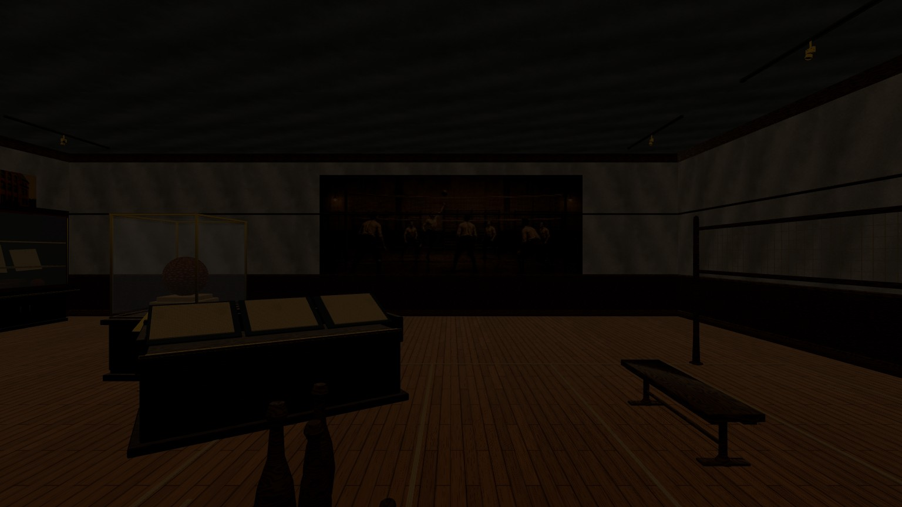
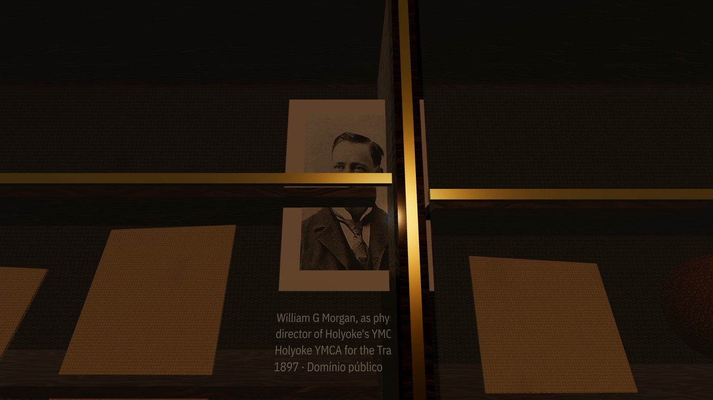
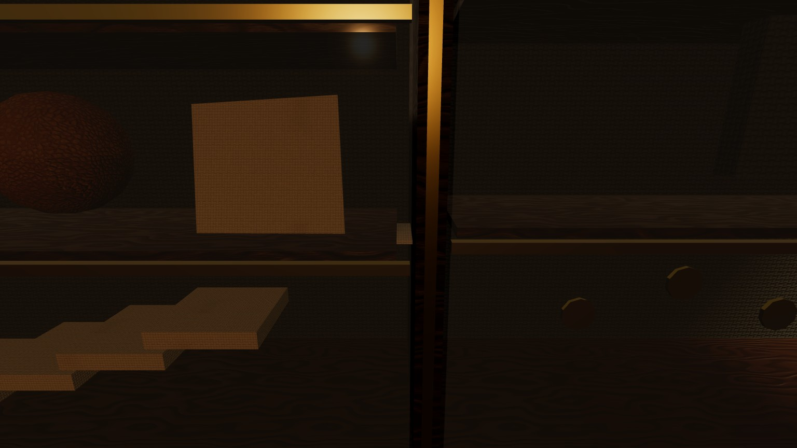
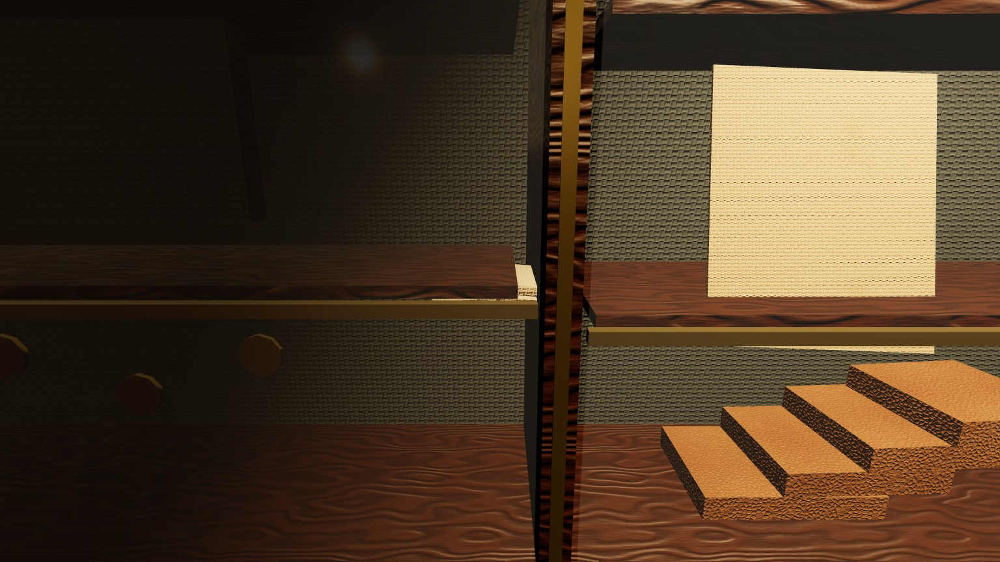
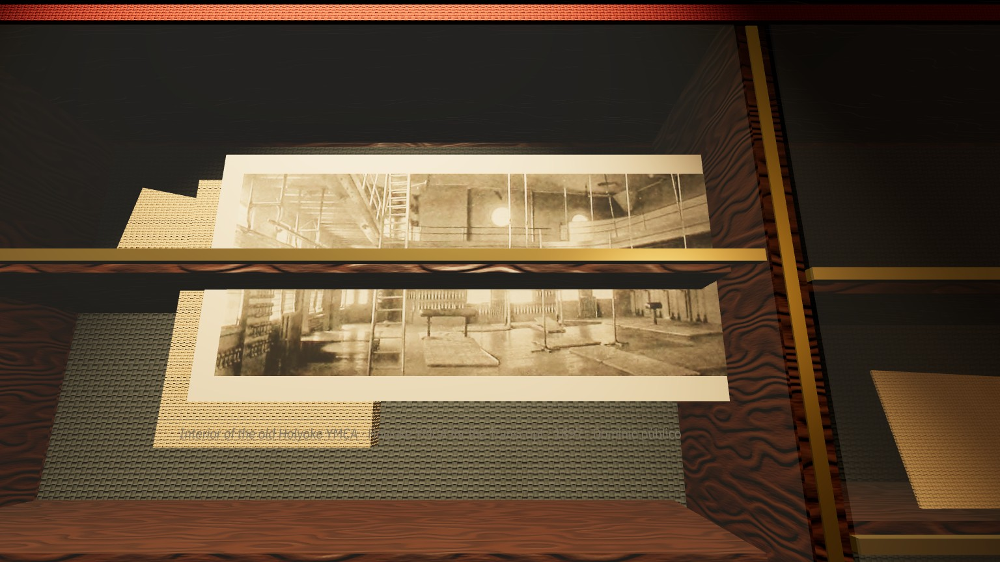
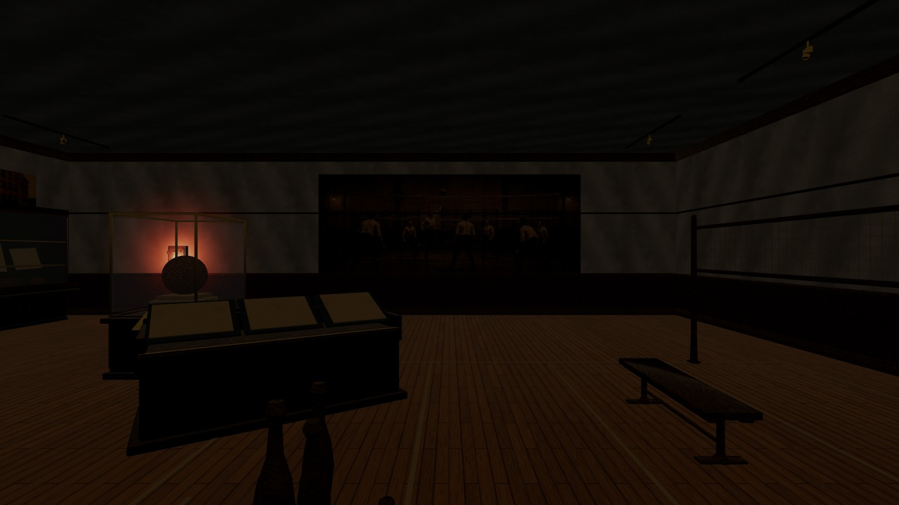
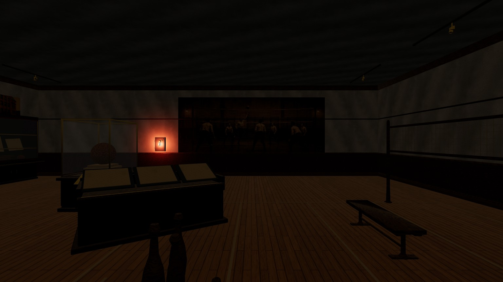
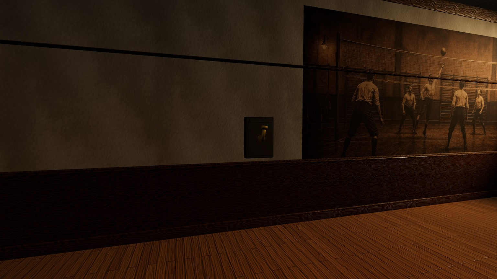
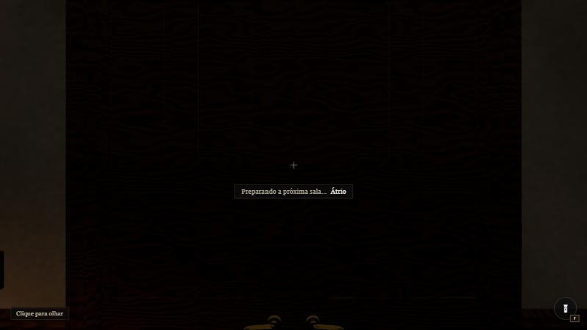

# P0 — Anexo E no navegador e linha de base

Medido em 2026-10-04, no commit `0061eb2` (o `main` antes deste registro). É o item 7 da
preparação de `docs/PLANO-ATE-O-FINAL.md`: os quatro itens do Anexo E de que o lote L1 depende
(#2, #3, #4 e #8) conferidos no navegador, e os contadores contra os quais todo lote seguinte
se compara. Nada mudou no jogo.

Este arquivo é um registro de um dia. Os números não são atualizados quando o jogo muda: o
lote que mexer num deles mede de novo, do mesmo jeito (seção 0), e escreve o depois no próprio
plano de lote. As 20 capturas citadas estão em `docs/contact-sheets/p0/`, com manifesto
congelado (`npm run test:captures`).

## Resumo

| Item | Veredito | O que L1 leva |
|---|---|---|
| Anexo E #2 | **confirmado**: da entrada, o piloto da Holyoke não acende um pixel | mover o quadro (H-26) |
| Anexo E #3 | **confirmado** nas quatro peças da vitrine corrida | centros de vão e topos de prateleira, na seção do #3 |
| Anexo E #4 | parede livre, **mas não em z = 5,0**: ali a vitrine-herói fica na frente do quadro | `position: [-5.86, 1.15, 2.2]`, `rotationY: Math.PI / 2` |
| Anexo E #8 | **confirmado**, e há um segundo desfecho pior: se a textura falha, a página fica em branco | tempo-limite **e** captura do erro do carregador |

A linha de base muda três números do livro-caixa (plano, 4.8): o par de salas com a porta
aberta chega a **128 draws** (o papel dizia 93, o teto é 100), a diagonal sudeste do átrio dá
**101** (dizia 100) e a textura residente é **107,08 MiB** (dizia 98,6). Detalhe em 2.5.

## 0. Como foi medido

- Servidor `museum-dev` reiniciado antes de começar (`http://localhost:5201`), servindo o
  `0061eb2`. Chrome 152, ANGLE sobre Direct3D 11, GeForce RTX 4080 Laptop.
- Viewport de 1280 × 720 CSS, qualidade `medium`, DPR 1,2: buffer de 1536 × 864, campo de
  62° na vertical e 93,78° na horizontal. São os mesmos números das cem capturas de 3 de outubro.
- **Reload limpo** quer dizer save vazio. O store grava o save ao descarregar a página, então
  limpar o `localStorage` e navegar devolve o save antigo. A ordem que funciona:
  `Storage.prototype.setItem = function () {}`, depois `localStorage.clear()`, depois
  navegar. Na tela de título o botão diz «Entrar no museu» (com save diria «Continuar»).
- O painel do navegador fica oculto: `requestAnimationFrame` não dispara e só
  `__museumStep(n)` anda o jogo. O `devicePixelRatio` cai para 1 a cada navegação; ele é
  fixado em 2 e um `resize` é emitido com um `requestAnimationFrame` provisório, para o
  canvas voltar a 1536 × 864.
- **Cada ponto:** `__museumTeleport(x, 0, z, yaw, pitch)` em coordenadas de mundo,
  `__museumStep(30)`, 400 ms de espera, `__museumStep(20)`, `__museumRender()` e a leitura de
  `__museumPerf()`. Ler depois do `__museumStep` ou depois do `__museumRender` dá o mesmo
  número de draws.
- **Assentado** quer dizer programas, geometrias e texturas de `renderer.info` iguais por 20
  rodadas seguidas (cada rodada: 60 frames, 350 ms, 20 frames). Com o painel oculto o
  aquecimento de GPU leva cerca de 70 s para assentar, porque as fatias ociosas são
  estranguladas; não é número de desempenho.
- Três sessões: `?qaPower=office`, `?qaPower=atrium` e `?qaPower=holyoke`. A tabela de 2.1 é
  a da terceira, de um reload limpo, com as três salas acesas (as outras duas pelo mesmo campo
  que o `qaPower` escreve, `progress.roomsPowered`) e os dez pontos percorridos na ordem da
  tabela. A primeira também partiu de save vazio; a segunda herdou o save da primeira (foi ali
  que o save gravado ao descarregar apareceu). As duas deram os mesmos draws e triângulos que
  a terceira, ponto a ponto.
- Além dos ganchos de `src/engine/PerfHud.tsx`, a cena foi lida de dentro da página pelo
  `_roots` do `@react-three/fiber` (o módulo que o próprio jogo importa, pelo mesmo endereço
  do Vite). É assim que saem os raios de visada do #4, a caixa de cada malha e o piloto ligado
  e desligado no mesmo quadro. Nada disso edita código: o quadro e o piloto foram **movidos
  na cena, só para a medição**, e devolvidos.
- Os quadros saem de `canvas.toDataURL('image/jpeg', 0.9)` para `POST /__capture`. O canvas
  não inclui o HUD; a única captura com HUD, `p0-o01-office-door-preparing-prompt-screen-lit`,
  é uma captura da tela do painel (800 × 450) reamostrada para 1536 × 864.

Duas armadilhas novas do harness, para quem repetir:

1. Uma chamada de JavaScript que passa de 45 s é dada como perdida, **mas continua rodando**.
   Uma delas terminou minutos depois e gravou um quadro por cima de outro já feito (o erro
   apareceu porque dois arquivos saíram com o mesmo hash). Trabalho longo vai em chamadas
   curtas, e depois de um estouro confere-se o hash de tudo o que foi gravado.
2. `img.decode()` não resolve com o painel oculto. Para ler pixels, `gl.readPixels` logo
   depois do `__museumRender()`, na mesma tarefa.

---

## 1. Anexo E

### Anexo E #2 — o piloto da Holyoke fica fora do campo de visão de quem entra

**Veredito:** confirmado. Do ponto e da orientação de entrada, o piloto não muda nenhum pixel.

Sessão: reload limpo em `?qaCamera=-10.2,0,-2,1.5708,0`, sem `qaPower`, lanterna apagada.

| Medida | Valor |
|---|---|
| Quadro (`museum.ts`, `holyoke-breaker`) | local `[5.86, 1.05, -4.2]`, parede leste, 2,2 m ao norte da porta |
| Caixa do quadro no mundo | x −9,557 a −9,390 · y 1,05 a 1,69 · z −4,43 a −3,97 |
| Piloto (point light `#d65a3a`, intensidade 3,2, alcance 2,4 m) | mundo `(-9.69, 1.37, -4.2)` |
| Câmera de entrada | mundo `(-10.2, 1.62, -2)`, olhando para oeste |
| Ângulo entre o eixo da câmera e o piloto | **103,0°** (o meio-campo horizontal é 46,9°); o piloto fica 0,51 m atrás do plano da câmera |
| Pixels do quadro que mudam com o piloto ligado e desligado | **0 de 1.327.104** (diferença máxima 0) |
| O mesmo, virando 106,5° para a direita, de frente para o quadro | 646.962 pixels (48,75%), diferença máxima 253 |

O teste dos pixels é o que fecha a questão do "clarão": o mesmo quadro foi desenhado duas vezes,
com a luz do piloto em 3,2 e em 0, e comparado canal a canal. Não há superfície dentro do campo
de visão que o alcance de 2,4 m toque.

- `p0-e01-holyoke-entry-pilot-out-of-view-dark-notorch`: o que o jogador vê ao entrar. Mural,
  vitrine-herói, quiosque, rede. Nenhum vermelho.
- `p0-e02-holyoke-entry-turned-to-breaker-dark-notorch`: o mesmo lugar, virado para o quadro.

Duas coisas que a medição mostrou de passagem, ambas já no plano:

- A lente do quadro (`breaker-panel__indicator`, 5,8 cm) é `glass-green` sem emissão. O
  vermelho é só a luz pontual (H-25, ÁT-A3).
- A 1,05 m, a base do quadro cai dentro da faixa do roda-meio (1,018 a 1,084 m, 36 mm de
  projeção), e o quadro fica a 15 mm do reboco: o roda-meio atravessa o quadro por trás
  (AS-H14).

### Anexo E #3 — as quatro peças da vitrine corrida

**Veredito:** confirmado nas quatro. Cada uma cruza um montante e uma prateleira; duas mal se veem.

Sessão: Holyoke acesa, câmeras da auditoria (`03-audit-holyoke.md`, H-13). As caixas saem da
cena (`Box3` de cada malha, em coordenadas locais da sala); os montantes e as prateleiras, de
`buildHistoryCaseRun` (`scripts/bake/parts/holyokeDecor.mjs:179-267`). "Triângulos" é quantos
triângulos da carcaça (`history-case-run`, nogueira) cortam a caixa da peça, por teste exato
de triângulo contra caixa.

| Peça | Câmera | Caixa da peça (local) | Montante | Prateleira | Triângulos | Captura |
|---|---|---|---|---|---:|---|
| `portrait-morgan` | `-14.1,0,6.45,3.1416,0.25` | x 0,911 a 1,389 · y 1,638 a 2,202 | x = 1,02: os 6,5 cm inteiros, de alto a baixo da moldura | y = 1,87 em 29,4 cm de largura; y = 1,83 em 3,4 cm | 12 | `p0-h01-case-run-portrait-morgan-lit` |
| `guide-1916` | `-16.2,0,6.45,3.1416,-0.25` | x −1,014 a −0,886 · y 1,320 a 1,331 | x = −1,02: 2,65 cm | y = 1,32: a peça inteira (1,1 cm) está **dentro** da tábua (1,3065 a 1,3335), em 5,9 cm de largura | 3 | `p0-h02-case-run-guide-1916-lit` |
| `handbook-1897` | `-18.2,0,6.45,3.1416,-0.25` | x −3,095 a −2,805 · y 1,320 a 1,372 | x = −3,06: 6,5 cm | y = 1,37: o topo entra 1,55 cm na tábua, em 18 cm; o livro fica **sob** a prateleira | 6 | `p0-h03-case-run-handbook-1897-lit` |
| `photo-gym` | `-11.6,0,6.3,3.1416,0.25` | x 2,880 a 4,420 · y 1,654 a 2,246 | x = 3,06: 6,5 cm | y = 1,91 em 1,285 m de largura; y = 1,87 em 10,5 cm | 14, mais 14 do recheio assado (a camisa) | `p0-h04-case-run-photo-gym-lit` |

O que se vê:

- **Retrato do Morgan** (a fonte do código `1896`): a prateleira e a régua de latão cortam o
  retrato na altura do rosto; o montante come a borda direita e corta a legenda no meio da
  frase («William G Morgan, as phys…»).
- **Guia de 1916:** uma lasca clara na ponta da tábua, entre a prateleira e o montante. O resto
  está dentro da madeira.
- **Manual de 1897:** só a ponta aparece, no fim da prateleira.
- **Panorama do ginásio:** a prateleira atravessa a fotografia de lado a lado.

Para o conserto (M40a exporta isto como `layout`; os números de hoje são estes): a vitrine tem
10,20 m e cinco vãos de 2,04 m. Em coordenadas locais da sala, com a vitrine em
`[0, 0, 7.86]` girada de π:

| Vão (centro em x) | −4,08 | −2,04 | 0 | +2,04 | +4,08 |
|---|---|---|---|---|---|
| Prateleira de baixo, centro / **topo** | 1,32 / **1,3335** | 1,37 / **1,3835** | 1,32 / **1,3335** | 1,37 / **1,3835** | 1,32 / **1,3335** |
| Prateleira de cima, centro | 1,87 | 1,91 | 1,83 | 1,87 | 1,91 |

Montantes de 6,5 cm em x = ±1,02, ±3,06 e ±5,10, da frente ao fundo. Cada prateleira ocupa o
centro do vão ± 0,945 m e tem 2,7 cm de espessura. O `supportY: 1.32` das peças é o **centro**
da tábua, não o topo.

### Anexo E #4 — a posição nova do quadro da Holyoke

**Veredito:** a parede oeste, lado sul, está livre do mural, da vitrine corrida e do emissor `holyoke-clock`, mas em z = 5,0 o piloto não se vê limpo da entrada: a vitrine-herói fica na frente. Posição recomendada: `position: [-5.86, 1.15, 2.2]`, `rotationY: Math.PI / 2`.

O que existe na parede oeste (coordenadas locais; a face do reboco está em x = −5,875):

| Vizinho | Onde |
|---|---|
| Mural `holyoke-gym-mural` | z −5,4 a 1,4 · y 0,85 a 3,65 |
| Vitrine corrida | z ≥ 6,82 (o latão da frente); começa em x = −5,13, a 0,745 m da parede |
| Emissor `holyoke-clock` | `[-5.5, 2.6, 4.0]` (sem modelo; H-28) |
| Lambri e roda-meio | lambri até 1,02 m; roda-meio de 1,018 a 1,084 m, 36 mm para fora |
| Trilho de quadros | 2,618 a 2,664 m |
| Vitrine-herói (no meio da sala) | x −1,73 a −0,27 · z 1,17 a 2,43; vidro de 0,85 a 2,12 m; a bola de 1,01 a 1,58 m |

O quadro tem 0,46 m de largura, 0,64 m de altura e 0,167 m de fundo (a alavanca chega a
0,249 m). A lente fica 0,505 m acima da base e 0,125 m para o lado norte; o piloto,
`pilotPosition: [0, 0.32, 0.3]`.

A medição da visada usou a câmera de entrada de #2 e a cena real: o grupo do quadro e a luz
do piloto foram levados a cada posição, e um raio foi lançado do olho até a lente, o piloto, o
centro e os quatro cantos do quadro, contra todas as malhas visíveis.

| | Proposta do plano: z = 5,0 | Recomendada: z = 2,2 |
|---|---|---|
| Caixa do quadro (z; y é 1,15 a 1,79) | 4,77 a 5,23 | 1,97 a 2,43 |
| Folga até o mural (acaba em z = 1,4) | 3,37 m | 0,57 m |
| Folga até a vitrine corrida | 1,59 m | 4,39 m |
| Distância até o emissor `holyoke-clock` | 1,13 m | 1,78 m |
| Folga acima do roda-meio / abaixo do trilho | 6,6 cm / 82,8 cm | 6,6 cm / 82,8 cm |
| Ângulo da lente ao eixo de entrada (limite do plano: 35°) | 32,6° | **20,8°** |
| Distância do olho à lente | 12,76 m | 11,49 m |
| Lente de 5,8 cm, na tela de 1280 × 720 | 2,7 px | 3,0 px |
| Quadro inteiro, na tela | 18 × 30 px | 22 × 33 px |
| Raio até a lente | atravessa os dois vidros da vitrine-herói, 6 cm acima da bola | **livre** |
| Raio até o centro do quadro | **bate na bola Spalding** (e no latão) | **livre** |
| Raios até os quatro cantos | os dois de baixo batem na bola; os de cima, só vidro | **livres** |
| O mesmo, da borda norte e da borda sul do vão da porta (z = −2,5 e −1,5) | vidro em todos; bola e latão em parte | **livres** nos sete raios |
| Clarão do piloto no quadro da entrada (piloto ligado × desligado) | 37.494 pixels (2,83%), diferença máxima 187 | 38.326 pixels (2,89%), diferença máxima 254 |

Por que z = 5,0 falha: da entrada, a vitrine-herói ocupa os azimutes de 25,1° a 39,8°, e a
proposta cai em 32,6°, bem atrás da bola. O clarão ainda aparece (é a luz na parede), mas o
quadro some atrás do couro. A parede fica desimpedida abaixo de 25°; descontando a largura do
quadro e a largura do vão da porta, a janela é **z de 1,9 a 2,5**. O meio dela, 2,2, deixa
0,57 m de reboco entre o quadro e o mural.

- `p0-e03-breaker-site-plan-z50-from-entry-dark-notorch`: a proposta do plano vista da
  entrada. A bola na frente do quadro.
- `p0-e04-breaker-site-recommended-z22-from-entry-dark-notorch`: a posição recomendada, no
  vão entre a vitrine-herói e o mural.
- `p0-h05-breaker-site-recommended-west-wall-lit`: a mesma posição de perto, com a sala acesa:
  acima do roda-meio, ao sul do mural.

Três ressalvas para L1:

1. **«Subtende ≥ 6 px» não vale para a lente.** A 11,5 m, seis pixels são 11,5 cm; a lente
   tem 5,8 cm e dá 3 px em qualquer ponto da parede oeste. O que se vê da entrada é o clarão
   (38 mil pixels) e o quadro (22 × 33 px). O teste de farol mede o clarão ou o quadro, ou a
   lente emissiva cresce para 12 cm.
2. **O piloto alcança o mural.** Em z = 2,2, com o alcance de hoje (2,4 m), a ponta sul do
   mural fica a 0,86 m da luz e ganha um banho vermelho no escuro. Some quando L10 reduzir o
   alcance a 0,8 m (ÁT-B4).
3. **x fica em −5,86**, como hoje (15 mm do reboco), para os dois quadros continuarem iguais
   até L10 assentá-los (ÁT-A2). A 1,15 m o quadro já passa por cima do roda-meio.

Com a mudança, os dois quadros deixam de ficar costas com costas: o da Holyoke vai para 11,7 m
da parede que divide as salas (ÁT-B4).

### Anexo E #8 — a porta do escritório quando uma textura do átrio não chega

**Veredito:** confirmado. Com uma imagem do átrio parada na rede, a porta fica em «Preparando a próxima sala…» para sempre. E se a imagem **falha**, em vez de parar, o jogo inteiro desmonta e a página fica em branco.

Simulação, sem tocar em arquivo: na tela de título, antes de o canvas existir, o `src` de
`HTMLImageElement` foi interceptado para uma única imagem que só o átrio usa,
`/textures/media/atrium-mural-attack.cfe8e9d4.webp`.

**(a) A imagem não chega** (o pedido é engolido: nem `load`, nem `error`). Reload limpo em
`?qaPower=office`, jogador em `(10.4, 0, 3)` de frente para a porta.

| Momento | Estado da porta (`focusedTransitionDoor`) | HUD (lido do DOM) | programas · geometrias · texturas |
|---|---|---|---|
| ao chegar | `loading` | «E · Preparando a próxima sala… · Átrio» | 18 · 86 · 31 |
| 30 s de jogo | `loading` | o mesmo | 29 · 106 · 31 |
| 70 s de jogo | `loading` | o mesmo | 29 · 106 · 31 |
| `E` | `loading`, `armed: true` | «Preparando a próxima sala… · Átrio» | 29 · 106 · 31 |
| 106 s de jogo (101 s de relógio) | `loading`, `armed: true` | o mesmo | 29 · 106 · 31 |

Controle, nas mesmas condições e sem a interceptação: a porta passa a «Abrir porta» 71 s
depois do clique (65 s de jogo), com 33 · 199 · 47. Na sessão interceptada os contadores param
em 29 · 106 · 31 e a cena fica com 197 malhas em vez de 207: o aquecimento do átrio nem começa.

O caminho no código: `Room` só enfileira o aquecimento de GPU quando os três limites de
`Suspense` do detalhe confirmam (`src/scenes/MuseumScene.tsx:557-589`). O terceiro é o
`RoomWallArt`, que suspende em `useLoader(TextureLoader)`; a promessa nunca resolve,
`isRoomReady('atrium')` nunca vale, e a porta só sai de `preloading` com `preload-ready`
(`src/engine/TransitionDoors.tsx:457-468`). Não há tempo-limite em lugar nenhum. O escritório
tem uma porta só.

- `p0-o01-office-door-preparing-prompt-screen-lit`: a tela, com o aviso sobre a porta fechada.

**(b) A imagem falha** (o mesmo pedido, desviado para um caminho que não existe). Console:
`Uncaught Error: Could not load /textures/media/atrium-mural-attack.cfe8e9d4.webp`, lançado
pelo `useLoader`. Não há limite de erro em volta de `RoomWallArt` nem de `FramedMedia`: a
falha chega 52 ms depois do pedido e o React desmonta tudo. `#root` fica vazio e a página é um
fundo escuro, com o jogador ainda no escritório, antes mesmo de chegar à porta. Não há captura:
é uma tela em branco.

O tempo-limite que o plano pede para ÁT-G2 resolve (a) e não resolve (b). Para (b), a falha do
carregador precisa ser apanhada (limite de erro ou textura de reserva) e cair no mesmo modo
degradado. O mesmo vale para qualquer arte de parede ou fotografia de qualquer sala.

---

## 2. Linha de base

### 2.1 Os dez pontos de referência

Câmera no formato de `?qaCamera=`: `x,y,z,yaw,pitch`, em coordenadas de mundo. Sessão única de
um reload limpo, as três salas acesas, pontos na ordem da tabela, portas fechadas (menos em R10).

| Ponto | Sala | Vista | Câmera | Draws | Triângulos | Programas | Captura |
|---|---|---|---|---:|---:|---:|---|
| R01 | office | ponto de leitura, a mesa a 1,2 m | `11.05,0,2.95,-1.5708,-0.45` | 58 | 36.086 | 35 | `p0-o02-ref-office-reading-lit` |
| R02 | office | spawn, as quatro estantes à vista | `10.3,0,2.95,-1.5708,-0.05` | 66 | 37.906 | 35 | `p0-o03-ref-office-spawn-lit` |
| R03 | atrium | da porta do escritório (o ponto de referência do átrio) | `8.2,0,3,1.5708,0` | 80 | 63.940 | 35 | `p0-a01-ref-atrium-from-office-door-lit` |
| R04 | atrium | diagonal sudeste | `7.8,0,7.8,0.7854,0` | 101 | 77.324 | 35 | `p0-a02-ref-atrium-diagonal-se-lit` |
| R05 | atrium | geral, do canto noroeste | `-7.8,0,-7.8,-2.3562,0` | 85 | 67.810 | 35 | `p0-a03-ref-atrium-overview-nw-lit` |
| R06 | atrium | chegada pela porta da Holyoke | `-8.2,0,-2,-1.5708,0` | 79 | 70.764 | 35 | `p0-a04-ref-atrium-from-holyoke-door-lit` |
| R07 | holyoke | da porta | `-10.2,0,-2,1.5708,0` | 36 | 37.108 | 35 | `p0-h06-ref-holyoke-door-lit` |
| R08 | holyoke | da porta, para sudoeste | `-10.2,0,-2,2.3562,0` | 67 | 51.468 | 35 | `p0-h07-ref-holyoke-door-sw-lit` |
| R09 | holyoke | geral, do canto noroeste | `-20.45,0,-7.2,-2.3562,0` | 83 | 63.050 | 35 | `p0-h08-ref-holyoke-overview-nw-lit` |
| R10 | holyoke | par de salas: a porta do átrio aberta, vista de dentro da ala | `-13.5,0,-2,-1.5708,0` | 128 | 101.310 | 35 | `p0-h09-ref-pair-door-open-lit` |

Como chegar a R10: em `(-10.6, 0, -2)` olhando para leste, `E` abre a porta; sem atravessar,
recuar até o ponto. A porta fica aberta enquanto o jogador está a menos de 5,5 m dela, e foi
conferida aberta por 12 s de jogo. `visibleRooms` passa a `holyoke, atrium` e as malhas visíveis
vão de 89 para 183.

Malhas visíveis: 104 no escritório, 110 no átrio, 89 na Holyoke; 273 no total com as três salas
residentes.

**Contra as medições anteriores.** R07 e R09 repetem exatamente os quadros `h01` e `h24` de
3 de outubro (36 / 37.108 e 83 / 63.050). R01 e R02 são as duas câmeras do `HANDOFF.md` §2 e
dão os mesmos draws, com 48 triângulos a mais cada (36.038 e 37.858 em 2 de outubro, antes das
últimas correções do escritório). R03 dá os mesmos 80 draws que o `HANDOFF.md` atribui ao
átrio (64.256 triângulos lá, 63.940 aqui), mas aquela câmera não foi registrada e a sala mudou
desde então: daqui em diante, «o ponto de referência do átrio» é R03. As câmeras dos quadros
`a01`, `a27`, `a28` e `a29` de 3 de outubro também não foram registradas; R03 a R06 são as
equivalentes, agora com coordenada (R04 dá 101 draws onde `a28` deu 100).

### 2.2 Programas, geometrias e texturas

Contagens de `renderer.info`, depois de assentar.

| Momento, a partir de um reload limpo | Programas | Geometrias | Texturas |
|---|---:|---:|---:|
| Primeiro quadro no escritório | 16 | 78 | 28 |
| Spawn assentado (escritório, mais o átrio aquecido atrás da porta) | 33 | 197 | 47 |
| Átrio, antes de chegar perto da porta da Holyoke | 33 | 199 | 47 |
| As três salas residentes (depois de entrar na Holyoke) | **35** | **267** | **53** |
| Depois de acender a lanterna uma vez | 35 | 267 | 53 |
| Depois de um exame (bola Spalding) | 35 | 267 | 53 |

Os 35 programas, por nome (`__museumPrograms()`): 11 sem nome; `brass` 4; dois de cada de
`archive-green`, `canvas`, `glass-green`, `glass-vitrine`, `maple-floor`, `plaster`,
`plastic-black`, `rug-burgundy` e `walnut-polished`; e os dois do PMREM (`CubemapToCubeUV`,
`PMREMGGXConvolution`).

Console depois de reload limpo: nenhum erro; um aviso por carga,
`THREE.Clock: This module has been deprecated`.

### 2.3 Bytes

**Modelos** (`public/models`; gzip de `npm run audit:geo2`):

| Arquivo | Bytes | gzip |
|---|---:|---:|
| `kit.aeabcf76.glb` | 2.241.880 | 1.047.359 |
| `room-atrium.b214394f.glb` | 157.364 | 61.060 |
| `room-holyoke.aa0b5458.glb` | 95.548 | 38.238 |
| `room-office.a2144060.glb` | 78.340 | 29.448 |
| `exhibits-atrium.6002cd90.glb` | 80.712 | 37.827 |
| `exhibits-holyoke.61443e51.glb` | 362.412 | 197.613 |
| Total | 3.016.256 | 1.411.545 |

O kit são 2.189,3 KiB: é o «2.189 KB» da catraca do plano.

**Código, por caminho** (`npm run build`; bytes em disco e o gzip que o próprio build imprime,
em kB de mil bytes). O caminho de cada chunk sai das listas de pré-carga que o build grava
(`__vite__mapDeps`) e dos dois `lazy()` do código: `main.tsx` carrega `MuseumApp` ao abrir a
página; `MuseumApp.tsx` carrega `Hud`, `Journal` e `MuseumCanvas` no clique.

| Caminho | Bytes | gzip (kB) | Chunks |
|---|---:|---:|---|
| Documento | 202.618 | 64,05 | `index.html` 852 · `index-CS4d83oU.js` 192.149 · `rolldown-runtime-QTnfLwEv.js` 694 · `index-DjjOxH4a.css` 8.923 |
| Tela de título | 88.117 | 28,80 | `MuseumApp-KEyXycEk.js` 6.131 · `audio-CExu7DDO.js` 8.037 · `i18n-BbB9Xqxe.js` 56.325 · `hudRules-DVCq3v3Z.js` 1.115 · `MuseumApp-DReznbHP.css` 16.509 |
| **Antes do clique** | 290.735 | 92,85 | os dois acima; o teto é 250 kB |
| **Depois do clique** | 1.383.064 | 391,73 | `MuseumCanvas-BVA0qvGY.js` 587.231 · `playerPosition-yTa34FZs.js` 725.309 · `Hud-CYZzFjPZ.js` 19.323 · `Journal-GwjY4GoE.js` 7.286 · `credit-Bm0Iztxm.js` 32.241 · `mobileControls-G2OOFLEs.js` 8.753 · `Notebook-Du13ZYB6.js` 2.921 |
| Acumulado | 1.673.799 | 484,58 | o teto depois do clique é 600 kB |
| Fontes do texto 3D | 170.004 | sem ganho | `IBMPlexSansCondensed-Regular` 83.340 · `SemiBold` 86.664 (`.woff`), pedidas depois do clique |

Texturas em disco: 1.269.562 bytes de materiais e 2.519.685 de mídia.

### 2.4 Textura residente

Lida na página com as três salas residentes: toda textura alcançável pelos materiais da cena,
conferida como enviada à GPU, contada como RGBA de 8 bits com a cadeia de mips (× 4/3) onde há
mips.

| Classe | Texturas | MiB |
|---|---:|---:|
| Materiais (albedo, normal e ORM das receitas) | 33 | 43,87 |
| Mídia de parede e fotografias | 14 | 62,21 |
| Atlas de texto (SDF do Troika, 2048 × 128, sem mips) | 1 | 1,00 |
| **Textura residente** | 48 | 107,08 |

`renderer.info.memory.textures` conta 53. As cinco a mais não saem dos materiais da cena (o
ambiente, o PMREM e alvos internos); não foram medidas uma a uma e não entram na soma.

A diferença para os 98,6 MiB do plano: `npm run audit:media` lista as duas imagens em SVG
(`atrium-orientation-wall.svg`, 1600 × 320, 2,60 MiB; `office-blueprint.svg`, 1200 × 800,
4,88 MiB) e as deixa fora do total, que dá 54,72. As duas estão na GPU como qualquer outra:
54,72 + 7,49 = 62,21. O resto é o atlas de texto.

### 2.5 O que a linha de base muda no livro-caixa

| Linha do livro-caixa (plano, 4.8) | Dizia | Medido | Consequência |
|---|---|---|---|
| Draws, par de salas com a porta aberta | 93 (teto 100) | **128** em R10; 108 a 1,35 m da porta, 118 a 2,25 m, 121 a 3,25 m, 130 a 4,75 m. Do lado do átrio, a 4,5 m da porta: 97 | o teto de 100 já está estourado hoje. A catraca de L1 para o par é 128; quem baixa é L6 (fusão do kit) e L17 (a vizinha sem as peças) |
| Triângulos, par com a porta aberta | 84.674 | 101.310 em R10 | dentro do teto de 150 mil |
| Draws por frame, átrio | 80; pico de 100 na diagonal sudeste | 80 em R03; **101** em R04 | dentro do teto temporário de 102 |
| Programas | 34 a 35 | 35 | a catraca é 35 |
| `kit.glb` | 2.189 KB | 2.241.880 bytes (2.189,3 KiB) | igual |
| Bundle antes do clique | ≈ 95 KB gzip | 92,85 kB | igual |
| Textura residente (catraca até L7) | 98,6 MiB | 107,08 MiB (106,08 sem o atlas de texto) | a catraca conta os SVG: 107,08 |

Por que o par passa de 100 com só uma fresta de átrio à vista (`p0-h09-ref-pair-door-open-lit`):
o descarte é pelo campo de visão da câmera, não pelo vão da porta. Com a porta aberta, tudo o
que o átrio tem dentro do cone da câmera é desenhado, visto ou não pelo vão de 1,6 m.

---

## 3. As capturas

Todas em `docs/contact-sheets/p0/`, 1536 × 864.

| Captura | O que mostra | Onde é citada |
|---|---|---|
| `p0-e01-holyoke-entry-pilot-out-of-view-dark-notorch` | a entrada da Holyoke, no escuro, sem lanterna | Anexo E #2 |
| `p0-e02-holyoke-entry-turned-to-breaker-dark-notorch` | o mesmo lugar, virado para o quadro | Anexo E #2 |
| `p0-e03-breaker-site-plan-z50-from-entry-dark-notorch` | o quadro na posição do plano (z = 5,0), visto da entrada | Anexo E #4 |
| `p0-e04-breaker-site-recommended-z22-from-entry-dark-notorch` | o quadro na posição recomendada (z = 2,2), visto da entrada | Anexo E #4 |
| `p0-h01-case-run-portrait-morgan-lit` | o retrato do Morgan na vitrine corrida | Anexo E #3 |
| `p0-h02-case-run-guide-1916-lit` | o guia de 1916 | Anexo E #3 |
| `p0-h03-case-run-handbook-1897-lit` | o manual de 1897 | Anexo E #3 |
| `p0-h04-case-run-photo-gym-lit` | o panorama do ginásio | Anexo E #3 |
| `p0-h05-breaker-site-recommended-west-wall-lit` | a posição recomendada, de perto, sala acesa | Anexo E #4 |
| `p0-o01-office-door-preparing-prompt-screen-lit` | a porta do escritório presa no aviso (tela, com HUD) | Anexo E #8 |
| `p0-o02-ref-office-reading-lit` | R01 | 2.1 |
| `p0-o03-ref-office-spawn-lit` | R02 | 2.1 |
| `p0-a01-ref-atrium-from-office-door-lit` | R03 | 2.1 |
| `p0-a02-ref-atrium-diagonal-se-lit` | R04 | 2.1 |
| `p0-a03-ref-atrium-overview-nw-lit` | R05 | 2.1 |
| `p0-a04-ref-atrium-from-holyoke-door-lit` | R06 | 2.1 |
| `p0-h06-ref-holyoke-door-lit` | R07 | 2.1 |
| `p0-h07-ref-holyoke-door-sw-lit` | R08 | 2.1 |
| `p0-h08-ref-holyoke-overview-nw-lit` | R09 | 2.1 |
| `p0-h09-ref-pair-door-open-lit` | R10 | 2.1, 2.5 |

Nas capturas `e03`, `e04` e `h05` deste conjunto o quadro de energia e a luz do piloto estão
onde a medição os pôs, não onde o jogo os tem. Nenhuma outra captura tem nada movido.

## 4. O que não foi medido

- Nada em aparelho real: é o item 6 da preparação, tarefa do dono.
- Tempo até o primeiro quadro e fps: o painel oculto estrangula temporizadores e não desenha
  por conta própria; qualquer número de tempo daqui seria falso.
- Os outros dezesseis itens do Anexo E, que pertencem a lotes posteriores.
